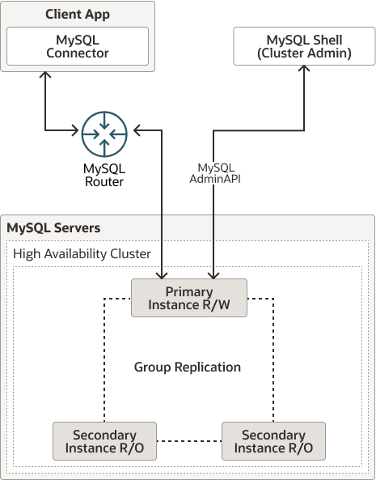
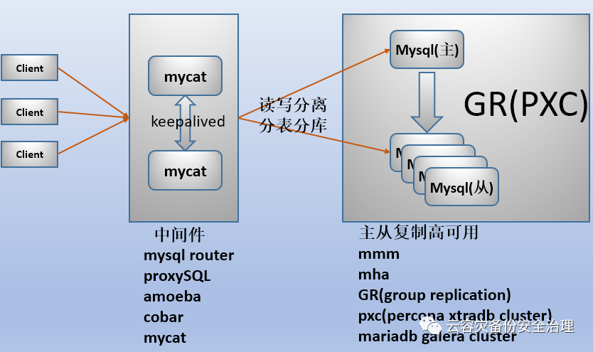

# mysqlrouter介绍和基本使用

## 1.mysqlrouter是什么
APP与数据库中间的一个轻量级的中间件（可理解为代理），即APP只访问mysqlrouter即可，不用理会数据库集群的拓扑变化

## 2.mysqlrouter怎么使用
    
### 2.1.下载

<https://dev.mysql.com/downloads/router/>

### 2.2.安装

**install command**: sudo rpm -i mysql-router-8.2.0-1.el7.x86_64.rpm
**uninstall command**: sudo rpm -e mysql-router-8.2.0-1.el7.x86_64.rpm

### 2.3.配置

**/etc/mysqlrouter/mysqlrouter.conf**
>**[DEFAULT]**
logging_folder = /var/log/mysqlrouter/                      #LOG存放的目录
plugin_folder = /usr/local/mysqlrouter/lib/mysqlrouter/     #其他插件目录
config_folder = /etc/                                       #配置存放的目录
runtime_folder = /usr/local/mysqlrouter/run/                #运行时相关文件存放的目录，比如PID文件
data_folder = /usr/local/mysqlrouter/data/                  #mysqlrouter相关数据存放目录
keyring_path = /var/lib/keyring-data                        #密钥环存储数据的路径，密钥环用于存储敏感信息
master_key_path = /var/lib/keyring-key                      #用于加密密钥环数据的主密钥的路径
connect_timeout = 1                                         #连接超时时间，单位是秒
**[logger]**
level = INFO                                                #日志级别
filename = mysqlrouter.log                                  #日志文件名称
timestamp_precision = second                                #日志时间戳的精度，默认是秒                                       

>**[routing:myCluster_rw]**                                 #路由规则用于读写操作，将流量定向到主节点
bind_address = 0.0.0.0                                      #绑定IP，全0全监听
bind_port = 6446                                            #绑定端口，一般是6446读写权限(用端口区分读写)
destinations = metadata-cache://myCluster/?role=PRIMARY     #mysqlrouter去连的HA数据库集群的IP端口列表（可以直接用IP端口而不去访问集群里的metadata-cache分主备）
routing_strategy = first-available                          #透明路由的策略，first-available，表示路由到第一个可用的服务器
protocol = classic                                          #通信协议，这里设置为classic，表示使用MySQL的经典协议
**[routing:myCluster_ro]**                                  #路由规则用于只读操作，将流量定向到从节点，并使用轮询策略在它们之间分配读请求
bind_address = 0.0.0.0                                      #绑定IP，全0全监听
bind_port = 6447                                            #绑定端口，一般是6447只读权限(用端口区分读写)
destinations = metadata-cache://myCluster/?role=SECONDARY   #mysqlrouter去连的HA数据库集群的IP端口列表（可以直接用IP端口而不去访问集群里的metadata-cache分主备）
routing_strategy = round-robin-with-fallback                #round-robin-with-fallback策略，表示按照轮询的方式分配连接，如果SECONDARY不可用，则回退到PRIMARY
protocol = classic                                          #通信协议，这里设置为classic，表示使用MySQL的经典协议
 
### 2.4.实验

**实验环境：**
>PCF FE01: 172.17.7.42
PCF FE02: 172.17.7.43
PCF FE03: 172.17.7.44
PCF BE01: 172.17.7.45
PCF BE02: 172.17.7.46

**command:**
> tcpdump -i any -s0 -ne -w  /home/captures/PCF_FE01_\$(date +%Y%m%d).pcap
> tcpdump -i any -s0 -ne -w  /home/captures/PCF_BE01_\$(date +%Y%m%d).pcap
> mysql -uroot -p123456 -h172.17.2.23 -P6446 -e 'show databases;' ; netstat -apn|grep -E "6446|3306"

### 2.5.查看监听状态

**command:**
> netstat -apn|grep -E "6446|Address|3306"

## 3.mysqlrouter的优点

### 3.1.官方发布（亲儿子）

>[官方Release版本](https://dev.mysql.com/doc/relnotes/mysql-router/8.0/en/)
解决“MySQL集群规模性迁移”：比如跨机房部署、流量迁移、异构兼容，或者解决MySQL集群规模性宕机时快速切换等.

### 3.2.轻量级（使用配置简单）

>1.APP层配置访问router即可
2.修改访问的集群只需要修改router配置文件，选择读写分离和轮训模式简单易读

## 4.mysqlrouter的缺点

### 4.1.过于轻量级
>MySQL Router太轻量级了，只能提供简单的基于端口的读写路由(Port based routing)，它不支持基于权重轮询的负载均衡(Weighted Balance)，也不支持基于SQL的读写分离(Query based routing)和空闲优先的负载均衡(Application Layer balancer)。

### 4.2.功能不丰富，插件少
>MySQL Router本身不会对请求“拆包”（unpackage），所以无法在中间件上实现“分库分表”、“隔离”，“限流”、“SQL审计”等功能，虽然MySQL Router提供了plugin机制，用户可以开发自己的plugin来扩展Router的功能，但是，对于绝大部分普通用户来说，这个都是比较难的一件事情。

### 4.3.多APP host的数据库集群变更时配置修改麻烦
>非InnoDB Cluster架构模式下，如果主从数据库拓扑变更，需要手工修改MySQL Router配置，而且需要重启MySQL Router服务（不支持reload），从而在一定程度上影响应用程序的可用性

### 4.4.router没有官方HA方案，需自行实现
>MySQL官方并没有提供Router的HA，我们一般要借助keepalived工具来实现MySQL Router的高可用性。

## 5.疑问和补充

1.查看galera cluster退出状态和新建集群命令:
>/var/lib/mysql/grastate.dat 
galera_new_cluster

2.查看集galera群状态命令
>mysql -uroot -p123456 -e "SHOW STATUS LIKE '%wsrep%';"

## 6.References
1.[mysqlrouter源码路径](https://github.com/mysql/mysql-router) 
2.[mysqlrouter官方文档](https://dev.mysql.com/doc/mysql-router/8.0/en/)  
3.[galera-cluster](https://mariadb.com/kb/en/what-is-mariadb-galera-cluster/)   
4.[InnoDB cluster](https://dev.mysql.com/doc/mysql-shell/8.0/en/mysql-innodb-cluster.html)  
5.[MySQL NDB Cluster](https://dev.mysql.com/doc/refman/8.3/en/mysql-cluster.html)  
6.[Markdown基本语法](https://markdown.com.cn/basic-syntax) 

